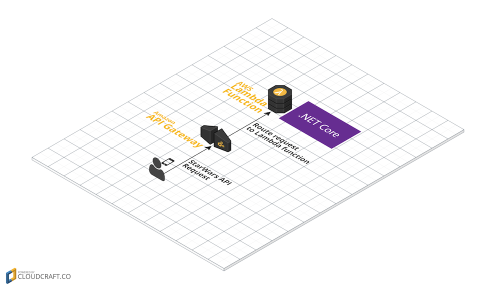

# ASP.NET Core and AWS Lambda
This repository is a simple starter focused on demonstrating how to run an asp.net core microservice API in the [AWS Lambda](https://aws.amazon.com/lambda/) environment

## This repository consists of:

*   A sample microservice API providing a selection of data from [the Star Wars API](https://swapi.co/).
    * `GET /api/starwars/characters?limit=5`
    * `GET /api/starwars/characters/search/skywalker`
    * `POST /api/starwars/characters` with a JSON body like this `{ "name": "Harry Skywalker", "eye_color": "blue" }`
*   A companion unit test project

## The starter guide consists of the following steps
1.  [Prerequisites, Clone, Restore and Run](STEP1.md)
2.  [Prepare our API to be deployed to AWS Lambda](STEP2.md)
3.  [Deployment to AWS](STEP3.md)
4.  [Publish Scripts and Further Reading](STEP4.md)

*Courtesy of [CloudCraft.co](https://cloudcraft.co)*
